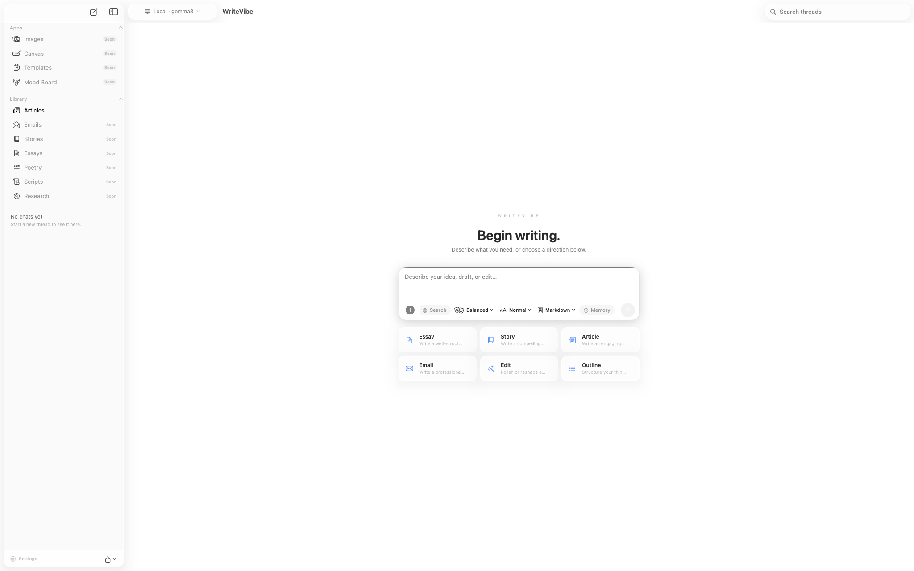
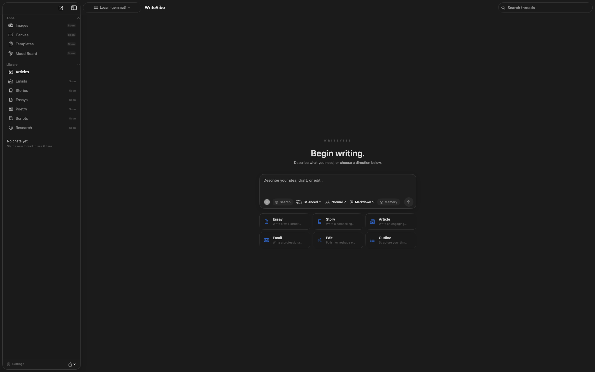

# WriteVibe

A macOS AI writing assistant built with SwiftUI.

## Screenshots

| Light | Dark |
|-------|------|
|  |  |

 Supports on-device Apple Intelligence, local Ollama models, and cloud AI providers — giving you a fully offline or cloud-connected writing experience.

## Features

- **Multi-provider AI** — Apple Intelligence (on-device), Ollama (local), Anthropic (direct SSE), and OpenRouter (Claude, GPT-4o, Gemini, DeepSeek, Perplexity Sonar, and more)
- **Streaming conversations** — Multi-turn chat with persistent history via SwiftData
- **Capability chips** — Tone, length, format, memory, and web search augmentation injected directly into prompts
- **Web search** — Perplexity Sonar context injection for grounded responses
- **Block-based Article editor** — AI-powered structured edits with diff review (`ArticleAIService`)
- **Writing analysis** — Tone, reading level, and improvement suggestions via Apple Intelligence
- **AI Copilot panel** — Parallel AI conversation sidebar for articles
- **Document ingestion** — Import `.txt`, `.md`, `.rtf` files or fetch and strip a URL
- **Export** — Copy to clipboard or save conversation as Markdown
- **Context window indicator** — Live token usage with color-coded warnings

## Requirements

- macOS 26+
- Xcode 16+
- For cloud models: OpenRouter or Anthropic API key (stored securely in Keychain)
- For on-device models: Apple Intelligence enabled on a supported Mac
- For local models: [Ollama](https://ollama.com) running on `localhost:11434`

## Getting Started

1. Clone the repo and open `WriteVibe.xcodeproj` in Xcode.
2. Build and run the `WriteVibe` scheme.
3. Open **Settings** to add an OpenRouter or Anthropic API key, or pull a model via the Ollama browser.

## Architecture

WriteVibe uses a protocol-based AI abstraction layer (`AIStreamingProvider`) backed by a `ServiceContainer` DI singleton. All providers are instantiated in `ServiceContainer` — never directly in views or state.

```
AppState (Observable)
  └── ConversationGenerationManager    — AI generation orchestration
        └── StreamingService            — delegates to subcomponents:
              ├── PromptAugmentationEngine  — chip validation, prompt injection protection
              ├── WebSearchContextProvider  — Sonar search context + sanitization
              └── AIStreamingProvider (protocol)
                    ├── OllamaService              — localhost:11434
                    ├── OpenRouterService           — cloud gateway (14+ models)
                    ├── AnthropicService            — direct Anthropic SSE
                    └── AppleIntelligenceService    — on-device FoundationModels
```

Data is persisted via **SwiftData** (`Conversation`, `Message`, `Article`, `ArticleBlock`, `ArticleDraft`). API keys are stored in the system **Keychain**. Security: URL scheme validation, model name validation, prompt injection protection via capability allowlists, Keychain input validation.

## License

Private — all rights reserved.
